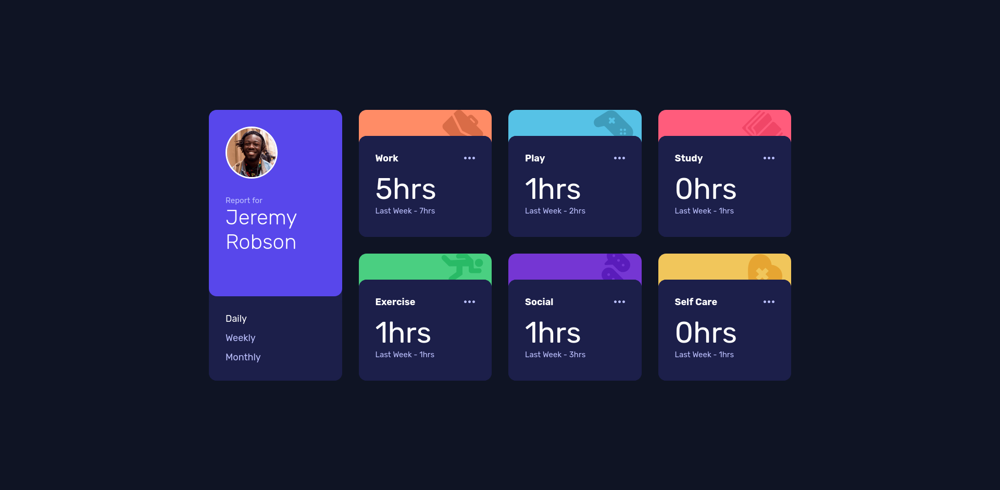
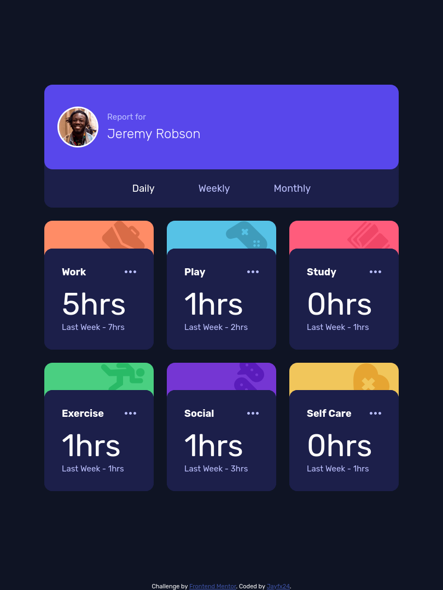
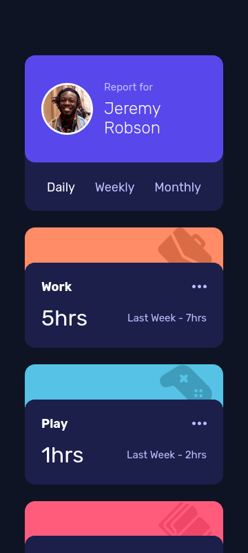

# Frontend Mentor - Time tracking dashboard solution

This is a solution to the [Time tracking dashboard challenge on Frontend Mentor](https://www.frontendmentor.io/challenges/time-tracking-dashboard-UIQ7167Jw). Frontend Mentor challenges help you improve your coding skills by building realistic projects. 

## Table of contents

- [Overview](#overview)
  - [The challenge](#the-challenge)
  - [Screenshot](#screenshot)
  - [Links](#links)
- [My process](#my-process)
  - [Built with](#built-with)

- [Author](#author)

## Overview

### The challenge

Users should be able to:

- View the optimal layout for the component depending on their device's screen size
- See the social media share links when they click the share icon

### Screenshot

#### Desktop

#### Tablet

#### Mobile

### Links

- Solution URL: [https://github.com/Jayfx24/FM-tracking-dashboard](https://github.com/Jayfx24/FM-tracking-dashboard)
- Live Site URL: [https://jayfx24.github.io/FM-tracking-dashboard/](https://jayfx24.github.io/FM-tracking-dashboard/)

## My process

### Built with

- Semantic HTML5 markup
- CSS custom properties
- Flexbox
- CSS Grid

## Author
- Frontend Mentor - [@jayfx24](https://www.frontendmentor.io/profile/jayfx24)
- Twitter - [@aeodunsi](https://www.twitter.com/aeodunsi)

